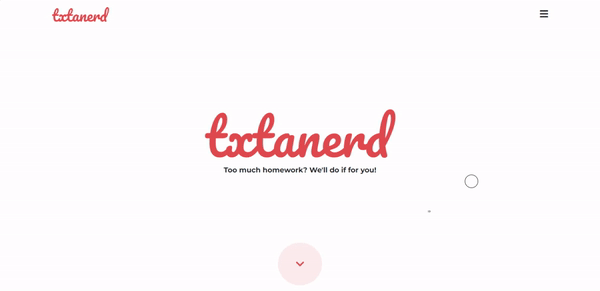

# Txtanerd

Txtanerd (Landing Page With HTML5, CSS3, JS, Bootstrap 5, jQuery)

## Build With

<p align="left"> <a href="https://getbootstrap.com" target="_blank" rel="noreferrer">  </a> <a href="https://www.w3schools.com/css/" target="_blank" rel="noreferrer">  </a> <a href="https://www.w3.org/html/" target="_blank" rel="noreferrer">  </a> <a href="https://developer.mozilla.org/en-US/docs/Web/JavaScript" target="_blank" rel="noreferrer">  </a> </p>

## Preview



## Template Structure

```shell
Txtanerd/                         # → Root of your Template
├── assets/                       # → Assets files
│   ├── css/                      # → Compiled CSS file
│   ├── img/                      # → Template images
│   ├── js/                       # → Template JS File
│   └── webfonts/                 # → Template icon fonts
├── index.html                    # → Index Page 
└── screenshot.gif                # → Template Screenshot
```
